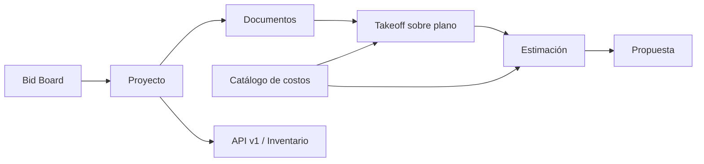

# TAKEOFF / Brightronix

Sistema web para administrar oportunidades de licitación y proyectos de construcción eléctrica. Centraliza documentos, mediciones sobre planos (takeoff), estimaciones de costos, catálogos de materiales y la preparación visual de propuestas.

La aplicación está construida con PHP, MySQL y JavaScript sin un framework de backend. No requiere un proceso de compilación: Apache sirve las páginas PHP y los recursos de `assets/` directamente.

## Contenido

- [Flujo funcional](#flujo-funcional)
- [Módulos del sistema](#módulos-del-sistema)
- [Arquitectura](#arquitectura)
- [Modelo de datos](#modelo-de-datos)
- [Instalación local](#instalación-local)
- [Configuración](#configuración)
- [API e integraciones](#api-e-integraciones)
- [Pruebas](#pruebas)
- [Estructura del repositorio](#estructura-del-repositorio)
- [Consideraciones conocidas](#consideraciones-conocidas)

## Flujo funcional



El uso normal del sistema es el siguiente:

1. Se registra una oportunidad en el **Bid Board**, con cliente, fecha de entrega, estado y estimador.
2. La oportunidad se convierte o se abre como **proyecto**.
3. En **Overview** se completa la información general, el cliente, notas y tareas.
4. En **Documents** se cargan planos y adjuntos. Un PDF o una imagen compatible puede enviarse a Takeoff.
5. En **Takeoff** se calibra la escala del plano y se crean conteos, longitudes o áreas organizados por grupos y capas.
6. Las cantidades medidas alimentan la **Estimación**. También se pueden agregar partidas manuales, elementos del catálogo y assemblies.
7. La **Propuesta** toma el proyecto, el cliente y la estimación activa para formar una vista comercial imprimible.

La ruta raíz redirige a `/pages/takeoff.php`, que a su vez abre `/pages/bid_board.php`. Por tanto, el Bid Board es el punto de entrada canónico actual.

## Módulos del sistema

### 1. Bid Board

**Pantalla:** `pages/bid_board.php`  
**Frontend:** `assets/bid_board.js`  
**Backend:** `api/project_module.php` y compatibilidad en `api/bid_board.php`

Es el tablero de oportunidades y proyectos. Permite:

- listar y filtrar registros por etapa del pipeline;
- ordenar proyectos y consultar su fecha límite;
- crear un proyecto nuevo, opcionalmente desde una plantilla;
- asignar un estimador;
- cambiar el estado de la oportunidad;
- duplicar, archivar o eliminar registros;
- abrir el workspace del proyecto.

Los estados visibles provienen de la base de datos (`bid_statuses` o estados de compañía) y no deben asumirse como una lista fija en el frontend.

### 2. Workspace del proyecto

**Pantalla principal:** `pages/project_dashboard.php?id={project_id}`

Es el contenedor de trabajo del proyecto. Carga un estado inicial desde MySQL en `window.ProjectState` y presenta cinco pestañas coordinadas:

#### Overview

**Frontend:** `assets/project_overview.js`  
**Backend:** `api/project_module.php`, `api/customers.php` y `api/project_document_takeoff.php`

- crea o actualiza los datos generales del proyecto;
- administra estado, número, fechas, dirección y metadatos;
- asigna o registra clientes;
- mantiene notas y tareas del proyecto;
- permite trabajar con un borrador antes de que exista un `project_id` definitivo;
- migra documentos temporales del navegador al proyecto al guardar el borrador.

#### Documents

**Frontend:** parte de `assets/project_overview.js`  
**Backend:** `api/project_documents.php` y `api/project_document_takeoff.php`

- carga planos y archivos adjuntos;
- organiza documentos en carpetas;
- permite buscar, ordenar, previsualizar, descargar, renombrar y eliminar lógicamente;
- conserva compatibilidad con dos modelos de almacenamiento: `files` (heredado) y `project_documents`;
- prepara un documento para Takeoff creando o reutilizando la identidad heredada que necesita el editor.

Formatos utilizables como plano: PDF, PNG, JPG/JPEG y WEBP. El flujo general de carga también contempla otros formatos de imagen heredados. Los archivos se guardan en `uploads/` o `api/uploads/`.

#### Takeoff

**Contenedor:** `assets/project_takeoff.js`  
**Editor:** `pages/editor.php` y `assets/editor/takeoff.js`  
**Backend:** `api/takeoff.php` y `api/takeoff_layers.php`

Es el módulo de medición gráfica sobre planos. Sus funciones principales son:

- visualizar PDF e imágenes por página;
- calibrar y guardar escalas por plano/hoja;
- crear mediciones de tipo conteo, longitud y área;
- dibujar marcadores, polilíneas y polígonos;
- usar ajuste angular con `Shift`, zoom, paneo y selección;
- organizar mediciones en grupos y capas;
- editar color, símbolo, tamaño, visibilidad y bloqueo;
- duplicar o eliminar capas y objetos;
- vincular una capa con un ítem o assembly del catálogo;
- calcular cantidades y resúmenes por capa;
- guardar automáticamente el estado y resolver cambios concurrentes por revisión.

El estado se aísla por proyecto, documento y estimación mediante `estimate_key`. Esto permite que distintas estimaciones de un mismo proyecto mantengan sus propias capas, escalas y mediciones.

#### Estimating

**Frontend:** `assets/project_estimating.js` y servicios `assets/estimating_*`  
**Backend:** `api/project_estimating.php`

Convierte las cantidades del Takeoff y los ítems del catálogo en una estimación económica. Permite:

- manejar varias estimaciones dentro del mismo proyecto;
- crear grupos y partidas jerárquicas;
- agregar partidas manuales, de Takeoff, de catálogo o assemblies;
- expandir assemblies anidados y consolidar sus componentes;
- calcular materiales, mano de obra, equipos, desperdicio, impuestos y markups;
- configurar margen o recargo y tarifas de mano de obra;
- mantener la cantidad vinculada al Takeoff cuando corresponde;
- guardar snapshots del catálogo y overrides propios del proyecto;
- detectar cambios posteriores en el catálogo, previsualizar su impacto y aplicar actualizaciones seleccionadas;
- exportar datos de BOQ/BOM desde los servicios de exportación;
- guardar con revisión optimista para impedir que dos clientes sobrescriban silenciosamente el mismo cálculo.

`estimate_workspace_states` conserva el snapshot completo y sin pérdida de cada estimación. Las tablas relacionales (`estimate_items`, `estimate_markups`, etc.) funcionan además como espejo para consultas e integración con código anterior.

#### Proposal

**Frontend:** `assets/project_proposal.js`

Genera una vista comercial usando el proyecto y la estimación activa. Permite configurar:

- datos del cliente y de la compañía;
- alcance, incluidos, excluidos y notas;
- agrupación de partidas;
- nivel de detalle, cantidades y costos visibles;
- propuesta de suma global o solo cantidades;
- resumen de materiales, mano de obra, impuestos y markups;
- líneas de aceptación y fecha.

La vista se puede imprimir con el navegador. Los botones de exportación directa a PDF y DOCX existen en la interfaz, pero actualmente muestran un aviso de integración pendiente y no generan esos archivos.

### 3. Cost Catalog

**Pantalla:** `pages/cost_catalog.php`  
**Frontend:** `assets/cost_catalog.js` y `assets/catalog_admin_service.js`  
**Backend:** `api/cost_catalog.php`, `api/catalog_admin.php` y `api/catalog_item_attachment.php`

Es la fuente maestra de costos utilizada por Takeoff y Estimating:

- administra catálogos y categorías jerárquicas;
- crea materiales, mano de obra, equipos y otros tipos de ítem;
- guarda unidad de medida, costo, horas de trabajo, códigos, fabricante, proveedor y clasificaciones;
- habilita o deshabilita contenido para proyectos;
- admite archivado, restauración, duplicación, movimiento y ordenamiento;
- permite adjuntar un PDF a un ítem;
- construye assemblies con componentes y reglas de proporción;
- evita ciclos en assemblies anidados;
- registra revisiones y eventos de auditoría;
- usa control de concurrencia mediante `expected_revision`.

Las reglas de assemblies admiten proporción por unidad, cantidad fija, longitud, área, extremo o espaciado, además de desperdicio y snapshots de precio.

### 4. Company Settings y herramientas globales

**Pantallas:** `pages/company_settings.php` y `pages/company_tools.php`  
**Frontend:** `assets/company_settings.js` y `assets/global_tools.js`  
**Backend:** `api/company_settings.php`

Administra valores compartidos por la aplicación:

- información general de la empresa;
- preferencias de estimación y formularios PDF;
- tipos de costo;
- estados de proyecto;
- tipos de estimación;
- usuarios mostrados en la configuración.

La barra global también da acceso al Bid Board, proyectos, catálogo y configuración, además de conservar el tema visual en `localStorage`.

### 5. Módulos heredados y de compatibilidad

El repositorio conserva pantallas anteriores que siguen siendo útiles o soportan datos históricos:

| Módulo | Archivo | Función |
|---|---|---|
| Proyectos | `pages/projects.php` | Lista y asignación de proyectos del flujo anterior. |
| Archivos | `pages/index.php`, `pages/archivos.php` | Carpetas, carga, papelera, restauración y eliminación de archivos. |
| Editor/preview | `pages/editor.php`, `pages/preview.php` | Visualización, anotación y reportes sobre PDF o imágenes. |
| Directorio | `pages/directorio.php` | Relación entre usuarios y proyectos. |
| Timeline | `pages/timeline.php` | Actividad reciente de proyectos, archivos y reportes. |
| Estimate simple | `pages/estimate_module.php` | CRUD simplificado conectado a `api/takeoff_layers.php`. |
| Project module | `pages/project_module.php` | Interfaz CRUD independiente del workspace actual. |

## Arquitectura

### Capas principales

| Capa | Responsabilidad |
|---|---|
| `pages/` | Entradas PHP y composición HTML de cada pantalla. |
| `views/` | Cabecera, navegación, sidebar, pie y modales compartidos. |
| `assets/` | Estado de interfaz, renderizado, cálculos y adaptadores de dominio en JavaScript. |
| `api/` | Endpoints JSON y acciones invocadas por el frontend. |
| `core/` | Conexión a base de datos, sesión, almacenamiento seguro y servicios comunes. |
| `db/migrations/` | Evolución incremental del esquema MySQL. |
| `integrations/` | Sincronización con sistemas externos. |
| `tests/` | Pruebas Node.js de contratos, cálculos, persistencia y comportamiento del frontend/backend. |

### Tecnologías y dependencias

- PHP 8.0 o superior;
- MySQL 8.0 o superior, InnoDB y `utf8mb4`;
- Apache con `mod_rewrite` y soporte para `.htaccess`;
- extensiones PHP `pdo_mysql`, `mbstring`, `json`, `fileinfo` y `curl` para la integración de inventario;
- navegador moderno con JavaScript habilitado;
- Node.js 18 o superior únicamente para ejecutar las pruebas.

El frontend carga desde CDN Bootstrap 5, Font Awesome, Google Fonts, PDF.js, Fabric.js, Konva, jsPDF y heic2any. Se necesita acceso a Internet para obtenerlos, salvo que se reemplacen por copias locales.

## Modelo de datos

El esquema se divide en estas áreas:

| Área | Tablas principales |
|---|---|
| Pipeline y proyectos | `projects`, `project_templates`, `estimators`, `bids`, `bid_statuses`, `estimating` |
| Catálogo | `catalogs`, `cost_catalogs`, `catalog_groups`, `catalog_items`, `catalog_item_attributes`, `assembly_parts`, `catalog_item_attachments`, `catalog_audit_events` |
| Documentos | `document_folders`, `project_documents`, `drawings`, `files`, `folders`, `sub_folders` |
| Takeoff | `takeoffs`, `takeoff_layers`, `takeoff_measurements`, `drawing_scales`, `takeoff_drawing_states`, `takeoff_sheet_scales`, `takeoff_count_markers`, `takeoff_linear_segments`, `takeoff_estimate_states`, `takeoff_estimate_scales` |
| Estimación | `estimates`, `estimate_items`, `estimate_markups`, `estimate_workspace_states` |
| Propuestas | `proposals` |
| Configuración | `company_settings`, `company_cost_types`, `company_project_statuses`, `company_estimate_types`, `company_setting_users` |

La mayoría de las entidades usa eliminación lógica mediante `deleted_at`. No se deben borrar archivos o registros directamente si existe una acción de archivo/restauración, porque otros módulos pueden conservar referencias.

## Instalación local

### 1. Preparar el entorno

En Windows puede utilizarse XAMPP:

1. habilitar Apache y MySQL;
2. colocar el proyecto dentro del directorio servido, por ejemplo `C:\xampp\htdocs\TAKEOFF`;
3. habilitar `mod_rewrite` y permitir `AllowOverride All` para que Apache lea `.htaccess`;
4. comprobar que PHP tenga habilitadas las extensiones indicadas arriba.

### 2. Crear la base de datos

```sql
CREATE DATABASE brightro_takeoff
  CHARACTER SET utf8mb4
  COLLATE utf8mb4_unicode_ci;
```

Importar primero `takeoff_mysql_schema.sql` y después los archivos de `db/migrations/` en orden ascendente por nombre. Las migraciones completan tanto el modelo nuevo como las tablas de compatibilidad (`files`, `folders`, estados compartidos, auditoría y adjuntos).

> El esquema base excluye deliberadamente identidad y control de acceso. Las pantallas heredadas que consultan `users` o `directory` requieren esas tablas de una instalación anterior. El workspace principal usa actualmente el modo standalone descrito en la sección de seguridad.

### 3. Configurar la conexión

Editar `core/db/connection.php` y establecer:

```php
$host = 'localhost';
$db = 'brightro_takeoff';
$user = 'usuario_local';
$pass = 'contraseña_local';
```

### 4. Preparar almacenamiento

Apache/PHP debe poder escribir en:

- `uploads/`;
- `uploads/reports/`;
- `api/uploads/`.

La configuración de PHP debe aceptar el tamaño de archivo esperado. El endpoint heredado permite hasta 1 GB, por lo que `upload_max_filesize` y `post_max_size` deben ajustarse si se necesitan planos grandes.

### 5. Abrir la aplicación

Con el proyecto servido como raíz del virtual host:

```text
http://localhost/
```

Si se sirve dentro de una subcarpeta y no como raíz, las rutas absolutas de `.htaccess` y algunos enlaces `/pages/...` deben adaptarse al prefijo correspondiente.

## Configuración

### Base de datos

La conexión está definida actualmente en `core/db/connection.php`. Para producción se recomienda mover las credenciales a variables de entorno o a un archivo no versionado y rotar cualquier contraseña que haya sido incluida previamente en el repositorio.

### Sesión y acceso

`core/auth/session.php` funciona como un shim de compatibilidad: crea una sesión local con usuario administrador y `requireRole()` siempre autoriza. En el estado actual **no existe autenticación ni autorización real para el módulo standalone**.

Antes de publicar el sistema en Internet se debe:

- implementar inicio de sesión real;
- aplicar autorización en cada endpoint;
- proteger formularios y mutaciones contra CSRF;
- restringir las carpetas de administración y diagnóstico;
- sacar secretos y credenciales del código fuente.

### API v1

Los clientes HMAC se configuran en `api/v1/config.php`. Sustituir los secretos de ejemplo antes de utilizar la API y mantener ese archivo fuera de exposición pública.

## API e integraciones

### Endpoints internos principales

| Endpoint | Uso |
|---|---|
| `api/project_module.php` | Listado, detalle, guardado, copia, archivo y acciones de documentos del proyecto. |
| `api/project_documents.php` | Obtener, renombrar, descargar, eliminar o iniciar Takeoff desde un documento. |
| `api/project_document_takeoff.php` | Cargar o normalizar un plano para el editor. |
| `api/takeoff.php` | Bootstrap, estado, escalas y persistencia gráfica del editor. |
| `api/takeoff_layers.php` | Capas y estimación simplificada/compatible. |
| `api/project_estimating.php` | Carga, guardado, patch y eliminación de estimaciones completas. |
| `api/cost_catalog.php` | Lectura del catálogo y operaciones de compatibilidad. |
| `api/catalog_admin.php` | Comandos administrativos con revisión y auditoría. |
| `api/catalog_item_attachment.php` | PDF adjunto a un ítem del catálogo. |
| `api/company_settings.php` | Configuración y listas maestras de la compañía. |
| `api/customers.php` | Directorio de clientes. |
| `api/api.php` | Acciones heredadas de proyectos, carpetas, archivos y reportes. |

### API v1 con HMAC

La API externa vive bajo `/api/v1` y firma cada solicitud con SHA-256. Requiere:

- `X-Client-Id`;
- `X-Timestamp` en segundos Unix;
- `X-Signature`.

El texto firmado es:

```text
METHOD + "\n" + PATH + "\n" + TIMESTAMP + "\n" + RAW_BODY
```

Endpoints disponibles:

| Método | Ruta |
|---|---|
| GET | `/api/v1/health` |
| GET | `/api/v1/projects` |
| GET | `/api/v1/projects/{id}` |
| GET | `/api/v1/projects/{id}/export` |
| POST | `/api/v1/projects` |
| PATCH | `/api/v1/projects/{id}` |
| POST | `/api/v1/projects/{id}/assign` |
| GET | `/api/v1/projects/{id}/folders` |
| POST | `/api/v1/files` |
| GET | `/api/v1/directory` |

La tolerancia de reloj predeterminada es de 300 segundos. Hay ejemplos de firma y `curl` en [`api/v1/README.md`](api/v1/README.md).

### Sincronización con inventario

`integrations/inventory/sync_project.php` exporta un proyecto mediante la API v1 y lo envía a un endpoint externo de inventario.

Variables requeridas:

```text
ELECTROPLAN_API_BASE
ELECTROPLAN_CLIENT_ID
ELECTROPLAN_CLIENT_SECRET
INVENTORY_UPSERT_URL
```

Variable opcional:

```text
INVENTORY_SHARED_KEY
```

Ejecución:

```bash
php integrations/inventory/sync_project.php 123
```

## Pruebas

La suite usa el runner nativo de Node.js y no necesita instalar dependencias npm.

Ejecutar todo:

```bash
node --test tests/*.test.js
```

Ejecutar un archivo concreto:

```bash
node --test tests/estimate_calculation.test.js
```

Las pruebas cubren cálculos, assemblies, catálogo, persistencia de estimaciones, concurrencia, sincronización bidireccional Takeoff/Estimating, documentos, interacciones del editor y contratos de API. Varias pruebas son contractuales: inspeccionan el código para impedir regresiones en rutas, seguridad de archivos o compatibilidad.

No hay actualmente una suite PHP de integración que levante una base de datos temporal; para cambios de persistencia conviene ejecutar además una prueba manual contra MySQL.

## Estructura del repositorio

```text
TAKEOFF/
├── admin/                 utilidades administrativas heredadas
├── api/                   endpoints internos y API v1
├── assets/                JavaScript y CSS de los módulos
│   └── editor/            lógica y estilos del editor de planos
├── core/                  base de datos, sesión, archivos y servicios
├── db/migrations/         migraciones incrementales MySQL
├── docs/                  contratos técnicos especializados
├── funciones/             helpers PHP heredados
├── integrations/          conectores con sistemas externos
├── pages/                 pantallas y puntos de entrada
├── tests/                 pruebas Node.js
├── uploads/               almacenamiento de documentos y reportes
├── views/                 componentes PHP compartidos
├── .htaccess              rutas de Apache
└── takeoff_mysql_schema.sql
```

## Consideraciones conocidas

- El sistema mezcla el modelo nuevo (`project_documents`, `drawings`) con el modelo heredado (`files`). Los adaptadores de documentos mantienen esa compatibilidad y no deben omitirse al iniciar Takeoff.
- El estado JSON de Estimating es la representación completa; las tablas relacionales son un espejo útil pero pueden no contener todos los detalles de interfaz.
- Las partidas tomadas del catálogo conservan un snapshot para que un cambio global de precio no altere automáticamente presupuestos históricos.
- La actualización desde el catálogo es explícita: primero detecta y previsualiza diferencias y luego aplica las seleccionadas.
- La eliminación suele ser lógica mediante `deleted_at`; la eliminación física debe reservarse para los flujos que la implementan expresamente.
- La propuesta imprime desde el navegador; PDF y DOCX directos todavía no están conectados.
- La aplicación depende de recursos CDN y de rutas absolutas pensadas para desplegarla en la raíz del dominio.
- El shim de sesión concede rol administrador y no es adecuado para una instalación pública.

## Documentación técnica adicional

Los contratos detallados del catálogo, assemblies, snapshots y actualizaciones se encuentran en `docs/`. Los documentos más relevantes son:

- [`docs/CATALOG_SERVICE.md`](docs/CATALOG_SERVICE.md)
- [`docs/CATALOG_ITEM_DTO.md`](docs/CATALOG_ITEM_DTO.md)
- [`docs/ASSEMBLY_EXPANSION_SERVICE.md`](docs/ASSEMBLY_EXPANSION_SERVICE.md)
- [`docs/ESTIMATING_CATALOG_SNAPSHOT_OVERRIDES.md`](docs/ESTIMATING_CATALOG_SNAPSHOT_OVERRIDES.md)
- [`docs/CATALOG_CHANGE_DETECTION.md`](docs/CATALOG_CHANGE_DETECTION.md)
- [`docs/CATALOG_UPDATE_PREVIEW.md`](docs/CATALOG_UPDATE_PREVIEW.md)
- [`docs/CATALOG_UPDATE_APPLICATION.md`](docs/CATALOG_UPDATE_APPLICATION.md)
- [`docs/TAKEOFF_CATALOG_METADATA_PERSISTENCE.md`](docs/TAKEOFF_CATALOG_METADATA_PERSISTENCE.md)

